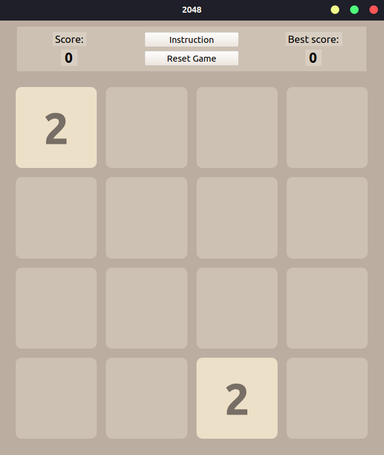

# 2048
My first game with GUI in C++ - 2048. Written in C++ and Qt QUI.

Here you can 
<a download="minesweeper.exe" href="minesweeper.exe" title="Minesweeper">
    download
</a>
this game in package. After download, you can unzip directory and run 2048.sh file by typing ./2048.sh in terminal.

Screenshot from the game (below):

Have fun! 
